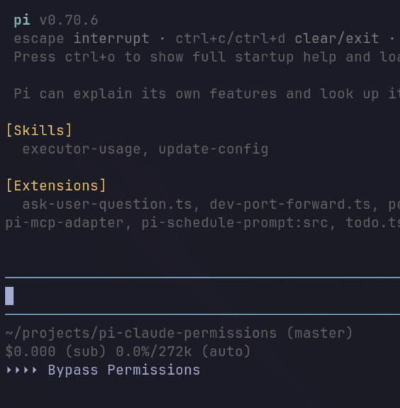

# pi-claude-permissions



Claude-style permissions for [pi](https://pi.dev), with configurable mode cycling and built-in plan mode.

This is my personal favorite permission cycling setup. Most of the time I run in `bypassPermissions`, or start work in `plan` mode and then let the agent execute once the plan looks good. If you prefer confirmation for everything, `default` mode is available too.

This is heavily based on and inspired by [`rHedBull/pi-permissions`](https://github.com/rHedBull/pi-permissions). Big shoutout to rHedBull for the original Claude Code-style permission workflow and safety checks. This version stays close to the Claude-style permission experience, defaults to bypass, uses `Shift+Tab`, supports `/permissions`, and adds plan mode.

## What is different?

- **Four modes**:
  - `default`
  - `plan`
  - `acceptEdits`
  - `bypassPermissions`
- **No `fullAuto` mode**.
- **`bypassPermissions` is the startup default**.
- **Configurable `Shift+Tab` cycle**.
- **`/permissions` always shows all modes** for manual selection.
- Includes a custom **plan mode**.

## Installation

From npm:

```bash
pi install npm:@zackify/pi-claude-permissions
```

Or from GitHub:

```bash
pi install git:github.com/zackify/pi-claude-permissions
```

## Modes

### `default`

Confirmation mode.

- Prompts before every tool call.
- Keeps session-level approvals for prompted operations.
- Still blocks protected paths and catastrophic commands.

### `plan`

Read-only exploration mode.

Allowed tools:

- `read`
- `bash` when the command looks read-only
- `grep`
- `find`
- `ls`
- `rg`
- `fd`
- `bat`
- `eza`

Blocked in plan mode:

- `edit`
- `write`
- mutating bash commands
- anything outside the read/search allowlist

When entering plan mode, the extension notifies:

```text
In plan mode, only read files/search tools are allowed.
```

It also injects visible planning instructions into the next agent turn so the model knows to inspect only and produce a detailed plan.

When leaving plan mode, the extension notifies:

```text
Plan mode ended
```

If you leave plan mode while the agent is idle and there is already at least one assistant response in the session, it sends this user message automatically:

```text
Plan mode ended. Execute the plan.
```

### `acceptEdits`

- Allows `write` and `edit` automatically.
- Prompts for bash commands.
- Still blocks protected paths and catastrophic commands.

### `bypassPermissions`

- Allows normal operations without confirmation.
- Still blocks catastrophic commands and protected paths.
- This is the default mode.

## Shortcut and command

By default, `Shift+Tab` cycles all modes:

```text
default → plan → acceptEdits → bypassPermissions → default
```

Use `/permissions` to manually select any mode at any time. If you rarely use one of the modes, set `piClaudePermissions.shiftTabOptions` to keep your `Shift+Tab` cycle faster; `/permissions` will still show all modes.

## Configuration

Set this in `~/.pi/agent/settings.json` or project-local `.pi/settings.json`:

```json
{
  "piClaudePermissions": {
    "defaultMode": "bypassPermissions",
    "allowCatastrophic": false,
    "shiftTabOptions": ["default", "plan", "acceptEdits", "bypassPermissions"]
  }
}
```

`defaultMode` controls the startup mode and defaults to `bypassPermissions`. Valid values are `default`, `plan`, `acceptEdits`, and `bypassPermissions`.

`allowCatastrophic` defaults to `false`. When set to `true`, catastrophic command blocking and critical `rm -rf` detection are allowed. Protected path checks still run.

`shiftTabOptions` defaults to all modes. Valid values are `default`, `plan`, `acceptEdits`, and `bypassPermissions`. This only changes the `Shift+Tab` cycle; `/permissions` still lists every mode.

## Safety checks kept from the inspiration plugin

This keeps the useful always-on protections from `rHedBull/pi-permissions`:

- catastrophic command blocking (unless `piClaudePermissions.allowCatastrophic` is `true`)
- critical `rm -rf` detection (unless `piClaudePermissions.allowCatastrophic` is `true`)
- protected path checks
- session-level approvals for prompted operations

## Files

The active local pi extension lives at:

```text
~/.pi/agent/extensions/permission-plan-mode.ts
```

This repository copy lives at:

```text
~/pi-claude-permissions/extensions/index.ts
```

After editing this copy, sync it back to pi with:

```bash
cp ~/pi-claude-permissions/extensions/index.ts ~/.pi/agent/extensions/permission-plan-mode.ts
```

Then reload pi with `/reload` or restart pi.
